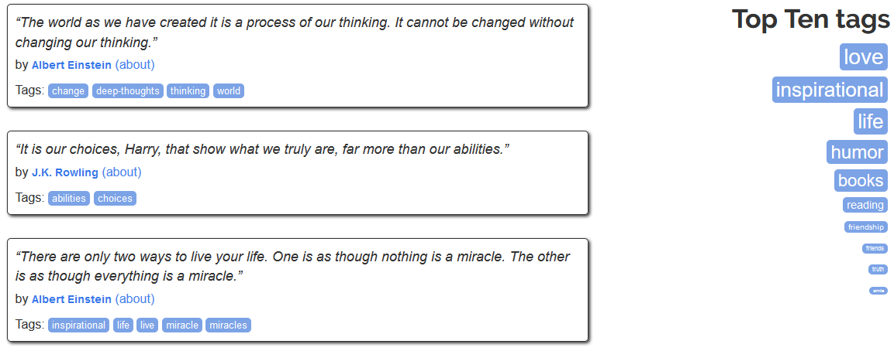

+++
image = "quotes_game.png"
date = "2020-01-20"
title = "Quotes Game"
type = "gallery"
+++

[Demo here!](https://quotes-game.chrispinkney.repl.run)

A quotation-based guessing game filled with data pulled from a scraper-friendly site.

The player has four guesses to figure out which famous person said the quote randomly selected from their website.

Also has an offline version! See the [readme.md](https://github.com/chrispinkney/quotes-game/blob/master/README.md#offline-mode) for more information.

#### Technology

The game is written in Python along with the Requests library to pull the data, and the Beautiful Soup library to scrape the information provided by [http://quotes.toscrape.com/](http://quotes.toscrape.com/).